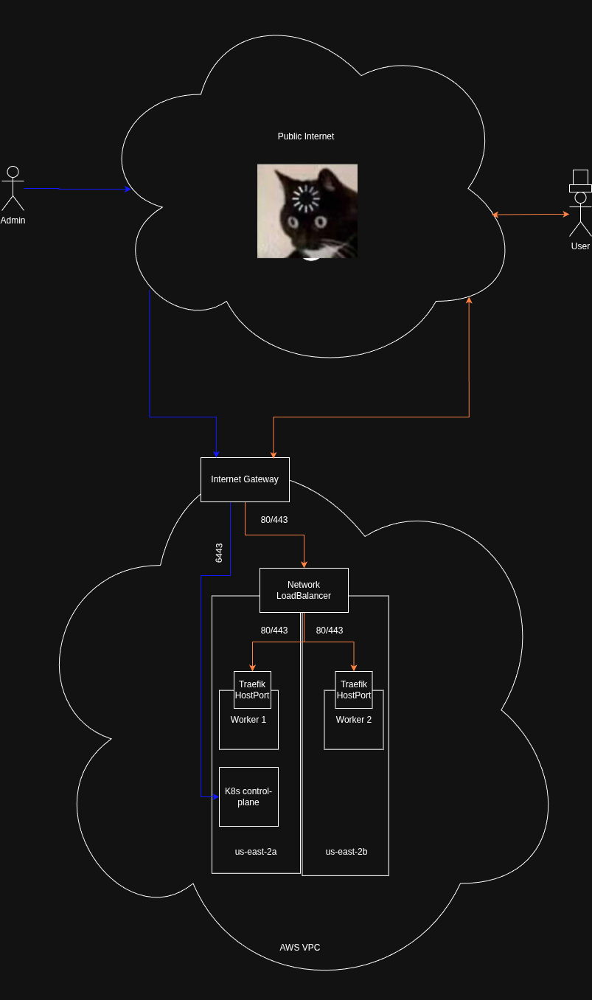

# Architecture Design Choices and Decisions.

In this document I hope to show the current architecture as it's laid out by this repo. I will go over some of the choices I made and why for each part.

[](../assets/webapp.png)

## Why so many automation tools?
This is a question that seemingly comes up quite a bit. The short answer is seperations of concerns. But let's take a look at our stack and talk through what it is all doing and why it's isolationed like it its.

### Terraform - Infrastructure provisoning and lifecycle
Terraform is a great tool for managing state and has a robust ecosystem for quickly provisioning state in a declarative manner. For this reason it's a great tool for spinning up nodes with images on them, Node network architecture, loadbalancers, DNS and other auxilary services.

**With this project I used Terraform to provison the following resources:**
```
-> ec2 machines with prebuilt Amazon AMIs
-> Installed ssh keypair for admin access to the nodes (and ansible)
-> A VPC to put our Infrastructure in a private network space
-> Two subnets for cross AZ worker nodes and private east to west cluster traffic.
-> A simple Network (Layer 4) LoadBalancer to connect to the two worker nodes on their application ports
-> Network policies that allow access to the ingress endpoint and kubernetes API endpoints
```
While I did make sure basic security was accounted for here there a few areas I could have potentially tightened up. A lot of these cases the additional complexity of management just wasn't worth the tradeoff:
```
-> Hardened AMI images could have been used. I didn't patch the system or check for vulnerabilities. This is small but I feel something like this is where a declarative or "cloud-native" immutable OS will shine.
-> Open east <-> west traffic between nodes. while I could have restricted this to known ports between the nodes there are better and more kubernetes native patterns for this such as Ciliums "Host Network Policies" which are much more portable for hybrid installs.
-> tighter access to Kube-API. Kubernetes secures it's API with mTLS which is pretty strong and depending on the algorithm used is going to be like breaking https. That said for long running infrastructure there is stilla risk of exploits on publically exposed administration services. So depending on the lifecycle of this environment it would be wise to maybe use a Jumphost or even Teleport to avoid accessing it outside of internal endpoints.
-> Restricting SSH. Much like the Kube-API SSH is protected by strong cryptography making public exposure a potential risk. This is where Teleport or a Bastion comes in handy
```

With Security being a tradeoff between complexity cost and Defense I feel I provided the most practical defaults for the request.

### Ansible - Machine configuration
With the core infrastructure set up we will have access to some bare bones linux nodes. We need to provision them with kubeadm to create a kubernetes cluster. This Ansible code sets up the machines as per install requirements of the [official kubernetes installation guide](https://kubernetes.io/docs/setup/production-environment/tools/kubeadm/install-kubeadm/).

Having ansible is very useful going forward as it allows us to collectively troubleshoot and configure all the nodes to keep them uniform going forward.


This ansible script will do the following:
```
-> disable swap on all the nodes
-> assure the proper kernel modules are loaded (onverlay, br_netfilter)
-> Set important sysctls for bridging and overlay.
-> install base packages.
-> install containerd
-> configure containerd to utilized systemd cgroups.
-> install the kubelet (and addtional kubernetes packages)
-> Uses kubeadm to initialize the control-plane with the latest version of k8s (currently 1.36)
-> captures the join command for the workers
-> builds an admin kubeconfig and sets the endpoint to the public ec2 address
-> joins the workers to the kubeadm deployed cluster
```

***Note: It's worth mentioning that technically nodes can be run with*** [swap activated](https://kubernetes.io/docs/concepts/cluster-administration/swap-memory-management/).

I choose to disable swap to reduce risk and complexity of management in this case.

**A worthwhile security note:** I have ansible auto-accepting ssh keys for the newly provisoned node. This is because you probably haven't sshed into these hosts before and ansible itself is non-interactive.

Normally it may not be the best method to do this depending on internal threat models as we should validate ssh keys to reduce the risk of a Man-in-the-Middle Attack. But in this case it works and our nodes are short lived so the risk is minimal.

**A worthwhile Infrastructure note:** Another kubernetes deployment method we could have used is the "three nodes all roles" strategy.

Currently, our kubernetes control-plane is on a single node so it is not HA. If this node goes offline so does all of our cluster access and management. This is risky and not advised in production deployments.

Another model for 3 nodes would be to allow scheduling onto the control plane and have all three nodes run as control-plane AND workers. It's generally not advised to run workloads on the same nodes as etcd specifically as etcd is very latency sensative around networking and i/o heartbeats. For a small web app workload the tradeoff is negliable.

### Core Workloads - Foundational cluster applications.
Ansible will leave us with a working cluster in the sense of being able to access certain resources but the nodes will show as "Not Ready" due to the lack of networking. This script will deploy the following resources:
```
-> Cilium CNI (With Hubble but not exposed)
-> Metrics server
-> Gateway-API CRDs
-> ArgoCD
```

We need a CNI in order to facilitate cross-node pod-pod networking which is why kubernetes will be stuck in a not ready state before this. The job of the Container Network Interface (CNI) is to create a L2 Overlay LAN in which the pods can share (normally something like VXLAN) across nodes (this is why those kernel modules and sysconfig settings from the ansible step are important btw).

I chose Cilium as it's currently the only graduated CNI in the [CNCF landscape](https://landscape.cncf.io/?group=projects-and-products&project=graduated). While this in itself says nothing about the readiness of production itself it does mean the project has strong vendor agnostic suppport. The risk of upstream "rug-pulling" is much lower than that of other CNI's. It also provides a lot of additional features that I could use for networking in the future (such as a L2 gARP broadcaster to replace MetalLB for On-prem deployments) or even it's own gateway-api implementations.

Hubble is installed by default. it's not exposed but can be pretty easily. It can be helpful troubleshooting tool in the future so i'm not going to bother ommiting it from the install.

Next up is the metrics server. I like to make a habbit of installing this right away as it is mostly set-it and forget it. It can come in very handy for minimal troubleshooting such as `kubectl top pods` or `kubectl top nodes`. It can also come in handy when Observablilty frameworks make their way into the picture.

Next is the Gateway-API CRDs. I explain it more below but Gateway-API is the future so installing these lightweight CRDs is a small toll for future-proofing the cluster design.

Finally we install ArgoCD. Argo is going to help us stop doing hands on administration of the cluster and start leveraging GitOps with upstream git repos as our source of truth. Reducing the number of hands on the cluster and making infrastructure declarative is the best way to reduce the risks accoiated with multi-tenant kubernetes deployments.

### Argo Apps - The GitOps Managed Application Deployments
From this point forward it is optimal to manage deployments and lifecycle of everything via ArgoCD "Applications". This allows us to move off the cluster and into a more developer familiar ecosystem - git!

For a production deployment I would normally leverage the [App-of-Apps](https://argo-cd.readthedocs.io/en/stable/operator-manual/cluster-bootstrapping/#app-of-apps-pattern-alternative) pattern that involves having a single repo that Argo watches with "Application" deployments. When updated Argo will install the Application which will instruct Argo to install the application referenced by the "Application" CRD.

